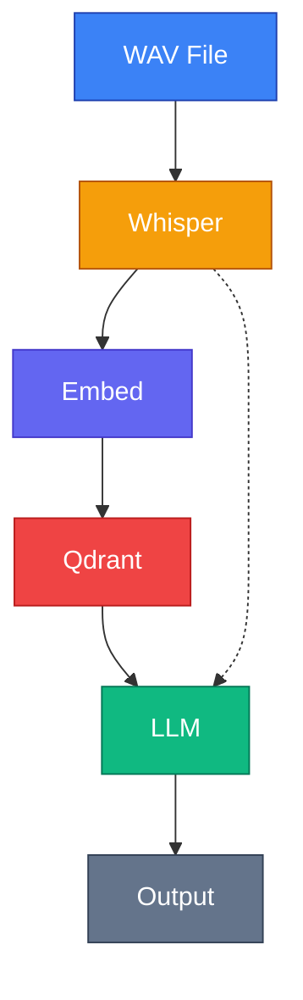

# ASR-RAG: Go Jargon Correction via RAG

Teaching PoC that demonstrates how a RAG pipeline can improve ASR transcription quality for Go programming terminology. Whisper often mishears Go-specific jargon (e.g., "go routines" instead of "goroutines"). By retrieving relevant terminology from a vector database and feeding it to an LLM, we correct these errors post-transcription.

## Architecture



## RAG Pipeline Detail

```mermaid
flowchart TD
    subgraph Seed ["seed"]
        CJ["corpus.json"]:::input
        SE["Embed"]:::embed
        UP["Upsert"]:::vectordb
        CJ --> SE --> UP
    end

    subgraph Transcribe ["transcribe"]
        WAV2["WAV"]:::input
        WH["Whisper"]:::asr
        RT["Transcript"]:::asr
        QE["Embed"]:::embed
        QS["Qdrant"]:::vectordb
        SYS["Prompt"]:::llm
        LLM2["LLM"]:::llm
        CT["Corrected"]:::output

        WAV2 --> WH --> RT
        RT --> QE --> QS
        QS --> SYS
        RT -.-> SYS
        SYS --> LLM2 --> CT
    end

    classDef input fill:#3b82f6,stroke:#1e40af,color:#fff
    classDef asr fill:#f59e0b,stroke:#b45309,color:#fff
    classDef embed fill:#6366f1,stroke:#4338ca,color:#fff
    classDef vectordb fill:#ef4444,stroke:#b91c1c,color:#fff
    classDef llm fill:#10b981,stroke:#047857,color:#fff
    classDef output fill:#64748b,stroke:#334155,color:#fff
```



## Stack

| Component | Tool | Port |
|-----------|------|------|
| ASR | whisper-server (whisper.cpp) | :8178 |
| Embeddings | Ollama `nomic-embed-text` (768-dim) | :11434 |
| Vector DB | Qdrant (Docker, gRPC) | :6334 |
| LLM | Ollama `llama3.2:3b` | :11434 |

## Color Legend

| Color | Component |
|-------|-----------|
| **Blue** | Input (WAV, corpus) |
| **Amber** | ASR — Whisper |
| **Indigo** | Embeddings — Ollama |
| **Red** | Vector DB — Qdrant |
| **Green** | LLM — Ollama |
| **Gray** | Output |

## Usage

```bash
# Start Qdrant
docker compose up -d

# Start whisper-server
~/.local/src/whisper.cpp/build/bin/whisper-server \
  -m ~/.local/src/whisper.cpp/models/ggml-medium.en.bin --port 8178

# Seed the vector DB with Go terminology
go run . seed

# Search for similar terms
go run . search "go routines"

# Transcribe and correct a WAV file
go run . transcribe sample.wav

# Record from mic and correct (default 5 seconds)
go run . record 5
```
