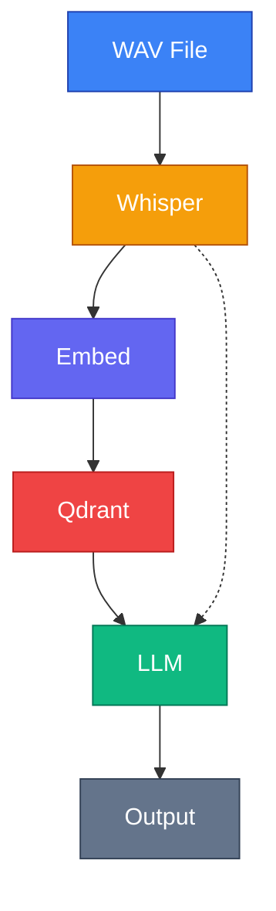
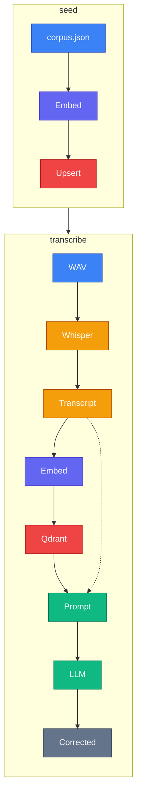
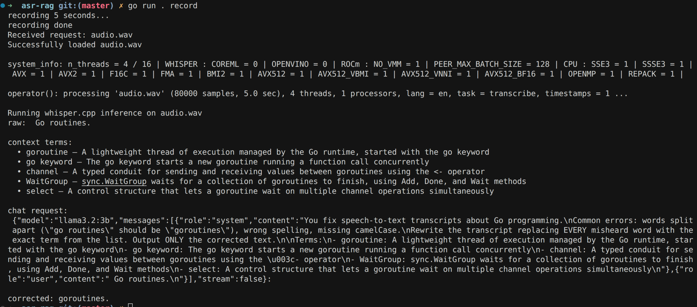

# Go jargon correction via RAG post-processing

Demonstrates RAG pipeline to improve automatic speech recognition transcription quality for Go programming terminology. Whisper often mishears Go-specific jargon (e.g., "go routines" instead of "goroutines"). By retrieving relevant terminology from a vector database and feeding it to an LLM, errors are corrected post-transcription.

## Architecture



## RAG Pipeline Detail



## How it works

### 1. Seed — build the knowledge base

`corpus.json` contains 61 Go terms and definitions. The `seed` command sends each entry through the `qwen3-embedding:8b` model to produce a 4096-dimensional vector, then stores the vector alongside its term and definition in Qdrant.

### 2. Record — capture and transcribe speech

The `record` command captures audio from the microphone, saves it as a WAV file, and sends it to a local Whisper server for speech-to-text. Whisper returns a raw transcript that often contains errors — e.g. "Go routines" instead of "goroutines".

### 3. Retrieve — find relevant terms

The raw transcript is embedded into the same vector space as the corpus. Qdrant performs a cosine similarity search and returns the 5 closest Go terms. This narrows 61 candidates down to a handful that are semantically relevant to what was spoken.

### 4. Correct — LLM picks the right substitutions

The raw transcript and the 5 retrieved terms are sent to `llama3.2:3b` as a chat prompt. The system instruction tells the LLM to replace misheard words with the correct Go term from the list. The LLM decides which terms apply and outputs the corrected transcript.

The key insight is that Qdrant handles **recall** (finding plausible matches) while the LLM handles **precision** (deciding which substitutions are correct in context).

## Prerequisites

```bash
# Pull required Ollama models
ollama pull qwen3-embedding:8b
ollama pull llama3.2:3b
```

## Stack

| Component  | Tool                                | Port   |
| ---------- | ----------------------------------- | ------ |
| ASR        | whisper-server (whisper.cpp)        | :8178  |
| Embeddings | Ollama `qwen3-embedding:8b` (4096-dim) | :11434 |
| Vector DB  | Qdrant (Docker, gRPC)               | :6334  |
| LLM        | Ollama `llama3.2:3b`                | :11434 |

## Color Legend

| Color      | Component           |
| ---------- | ------------------- |
| **Blue**   | Input (WAV, corpus) |
| **Amber**  | ASR — Whisper       |
| **Indigo** | Embeddings — Ollama |
| **Red**    | Vector DB — Qdrant  |
| **Green**  | LLM — Ollama        |
| **Gray**   | Output              |

## Usage

### Start services

```bash
# Start Qdrant (Docker) + whisper-server (local, GPU)
./run.sh

# View Qdrant logs (optional)
docker compose logs -f

# Qdrant dashboard
# http://localhost:6333/dashboard
```

### Stop services

```bash
./stop.sh
```

### Commands

```bash
# Seed the vector DB with Go terminology
go run . seed

# Search for similar terms
go run . search "go routines"

# Record from mic and correct (default 5 seconds)
go run . record 5
```

### Example output


